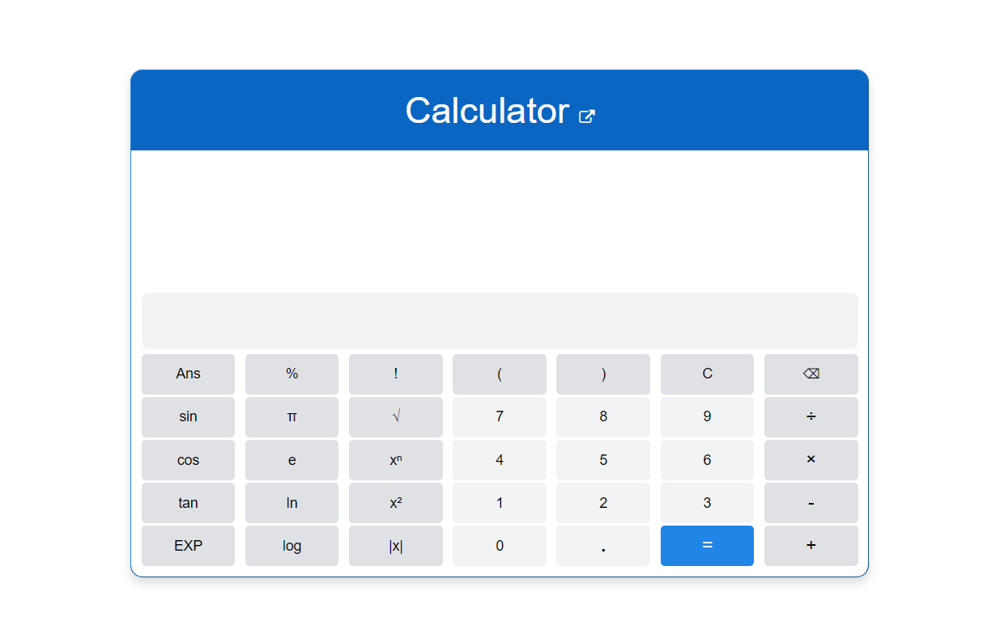

# [Scientific calculator](https://yogeshiitm.github.io/scientific-calculator/)
This is an online javascript scientific calculator, designed and coded by [Yogesh Agarwala](http://yogeshiitm.github.io/).\
**View it here: https://yogeshiitm.github.io/scientific-calculator/**
<!--  --> 
<a href="https://yogeshiitm.github.io/scientific-calculator/"></a>

## Some Features
1. The input of this calculator can be a multiple function expression, just like a physical scientific calculator.  
2. The back button in the calculator is designed to work smartly, e.g. if the back button is pressed after doing a calculation, then it will act as a clear button and will delete the entire string from the input text area, but at other times it will delete only the last character from the input expression. 
3. The calculator intelligently interprets a user's inputs even if proper parenthesis or multiplication signs are not used, instead of displaying an error, for example:
    ```sh
    15√(3+5!7π)sin(60°)^ln(log(5)e)7! ---> 15× √(3+5!×7×π) × sin(60°)ln(log(5)×e) × 7!
    3sin(60)4 ---> 3 × sin(60) × 4
    3sin(60×4 ---> 3 × sin(60×4)
    4²3²√(5+6 ---> 4²×3²×√(5+6).
    4²3²√(5)6 ---> 4²×3²×√(5) × 6
    4%3 ---> 4% × 3 ---> 0.04 × 3
    4^(3)πe ---> (4^3) × π × e
    4^(3πe) ---> 4^(3×π×e)
    3!5 ---> 3! × 5
    ```

4. It also checks if all the parentheses are balanced in the input expression (using Stack data structure), and then displays an error accordingly.
    ```sh
    abs(-5)) ---> Error displayed: closing bracket has been used before an opening bracket.
    (abs(-5) ---> Error displayed: brackets are not balanced.
    ```
    

## Near future plan
1. Input through keyboard: currently the calculator only supports click on the button through mouse (in desktop)
2. Switching between degree and radian: currently by default angle has to be entered in degree.
3. Inverse trigonometric functions are yet to be added.

    
**Note:** 
If you think there is a mistake in the calculation done by the app or find any other bug, please do [let me know](https://yogeshiitm.github.io/about).
